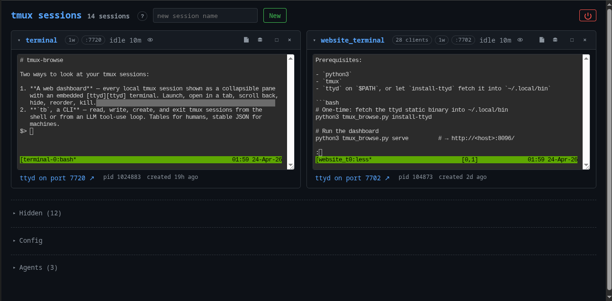
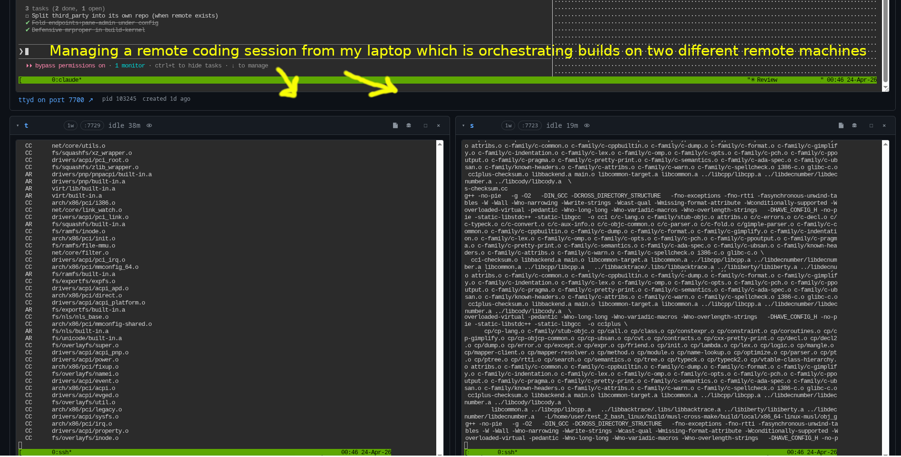
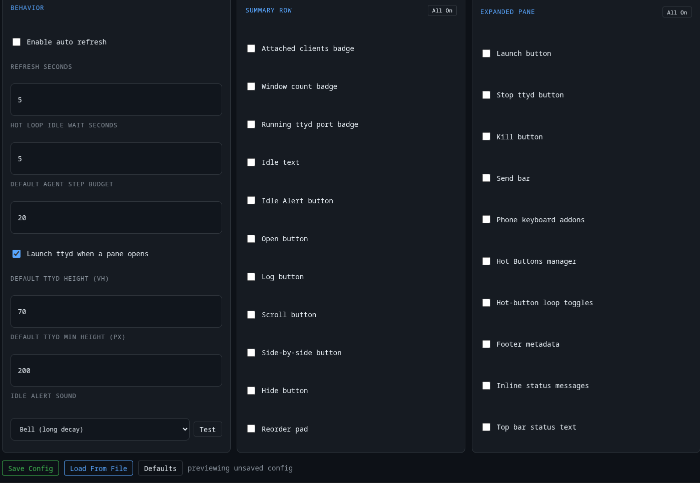

# tmux-browse

Two ways to look at your tmux sessions:

1. **A web dashboard** — every local tmux session shown as a collapsible pane
   with an embedded [ttyd][ttyd] terminal. Launch, open in a tab, scroll back,
   hide, reorder, kill.
2. **`tb`, a CLI** — read, write, create, and exit tmux sessions from the
   shell or from an LLM tool-use loop. Tables for humans, stable JSON for
   machines.

Both share the same Python library. Stdlib-only (`http.server`, `urllib`,
`subprocess`, `ssl`) — no pip dependencies; the only external is `ttyd`
itself, which the CLI can install for you.



[ttyd]: https://github.com/tsl0922/ttyd

## Install

Prerequisites:

- `python3`
- `tmux`
- `ttyd` on `$PATH`, or let `install-ttyd` fetch it into `~/.local/bin`

```bash
# One-time: fetch the ttyd static binary into ~/.local/bin
python3 tmux_browse.py install-ttyd

# Run the dashboard
python3 tmux_browse.py serve         # → http://<host>:8096/

# Or use the CLI
python3 tb.py ls
python3 tb.py exec work --json -- pytest -q
```

`install-ttyd` is only needed where `ttyd` isn't already on `$PATH`. If your
distro packages it (Debian/Ubuntu `apt install ttyd`, Homebrew `brew install
ttyd`), that works too.

### Installing the agent module

The agent platform lives in a separate repo
[tmux-browse-agent](https://github.com/itsmygithubacct/tmux-browse-agent)
and is opt-in. Three ways to enable it:

```bash
# 1. In the running dashboard: Config → Extensions → Agents
#    module → Download and enable. Restart when the banner appears.

# 2. Headless host with the dashboard not running:
make install-agent            # uses the same install path as the UI

# 3. Clone everything at once, then enable:
git clone --recursive https://github.com/itsmygithubacct/tmux-browse.git
cd tmux-browse
make enable-agent             # flips the bit; restart the dashboard
```

Manage an already-installed agent with `make update-agent`,
`make disable-agent`, `make uninstall-agent`, or (three-step
confirmation to destroy state) `make uninstall-agent-with-state`.
State files under `~/.tmux-browse/` are kept by every other path.

## Quick Start

If you want to try it immediately, create a throwaway tmux session first:

```bash
# Create a scratch session
python3 tb.py new demo

# Run a command inside it
python3 tb.py exec demo --json -- pwd

# Start the dashboard
python3 tmux_browse.py serve
```

Then open `http://localhost:8096/` on the same machine. The dashboard is most
useful once at least one tmux session exists.

## Drive an agent from the terminal, watch it in the browser


Because `tb` exposes tmux as a CLI, an agent can use it as a tool: you run
the agent in one session and tell it to drive a coding session (claude,
codex, aider, …) in another, pinning the build/test output to a third.
Each session is its own pane in the dashboard, so you watch the whole
pipeline from a second monitor or your phone.

```bash
# Three sessions: the agent, the coding session it drives, the output pane
tb new agent
tb new coder
tb new website_terminal

# Start a coding agent in "coder" and a long-running build in "website_terminal"
tb type coder "claude"
tb type website_terminal "npm run dev"

# Kick off the orchestrating agent and give it the targets as instructions
tb type agent "gpt"
tb type agent "drive 'coder' to add a /health endpoint; surface build output in 'website_terminal'"
```

The agent uses `tb type coder "..."` to prompt the coding session and
`tb capture website_terminal` to read back what the build produced —
everything stays visible in the dashboard the whole time.

See [docs/recipes.md](docs/recipes.md) for the full LLM tool-use pattern
(`snapshot` → `exec` + `wait` → `capture`).

## Orchestrate across remote machines



Each dashboard pane is whatever its tmux session is running — so if some
of those sessions are `ssh` shells into remote hosts, one local dashboard
becomes a cockpit for real work happening on many machines. Drive a
coding agent in one pane while it kicks off builds in two other panes
that are themselves `ssh` sessions to remote boxes; watch all three in
the same browser tab.

```bash
# Local sessions whose first command is an ssh hop
tb new coder
tb new builder_a
tb new builder_b
tb type coder       "ssh dev-laptop -- claude"
tb type builder_a   "ssh builder-1.internal"
tb type builder_b   "ssh builder-2.internal"
```

Everything the agent does via `tb` in those panes happens on the remote
host at the far end of the ssh — tmux just transports the terminal,
tmux-browse transports tmux.

## Built-in agent platform (under active development)

> **Heads-up:** the agent layer described here is under active
> development. The shapes below are stable enough to use but the
> CLI options, defaults, and some endpoints may shift between patch
> releases until the next minor-version bump.

Beyond driving external agent CLIs through `tb`, tmux-browse ships a
**first-class agent runtime** that turns named LLM agents into
long-running, observable, sandbox-able workers. Everything still
lives on top of the same `tb_command` tool surface, the same run
index, and the same tmux primitives — but an agent is now a
persistent record you can run, schedule, compose, and audit.

**Agents**

```bash
# Add an agent (reads API key from stdin)
printf '%s' "$ANTHROPIC_API_KEY" | tb agent add opus --api-key-stdin
printf '%s' "$OPENAI_API_KEY"    | tb agent add gpt  --api-key-stdin

# Run one-shot against a prompt
tb agent opus "snapshot every tmux session and report idle ones"

# Or open a persistent REPL (conversation + knowledge base + context)
tb agent repl opus
```

Provider, model, base URL, and wire API are per-agent; switching from
Anthropic to OpenAI to Kimi to MiniMax is a config-file change, not a
code change.

**Isolation**

Each agent picks its sandbox mode: `host` (default), `worktree`
(git-worktree isolation for task work), or `docker` (a short-lived
container with its own tmux server inside). Docker mode is
**fail-closed** — a missing daemon or a startup failure is a hard
error, never a silent fallback to the host.

**Modes**

Long-running postures above the single-shot runner:

- **Cycle** — one planning-then-execute turn per invocation. The
  agent produces a short plan, then runs against that plan with the
  normal tool budget.
- **Work** — file-backed task queue runner. One task per line;
  `.done` sibling makes it resumable across restarts.

Each mode surfaces as both a CLI verb (`tb agent cycle`,
`tb agent work`) and a dashboard button.

**Conductor rule engine**

Composite policy above per-event hooks: rolling-window counters
("three failures within one hour"), cross-agent routing
("on sonnet rate-limit, retry on opus"), and a decision log that
records every firing so you can always answer *why* something
happened.

**Observability**

Every run — CLI, REPL, scheduler, conductor, cycle, work, retry —
lands in the same JSONL run index with its origin tagged, searchable
from the Runs section of the dashboard. Per-agent idle detection
uses a content-hash of each session's pipe-pane log, not tmux's
cursor-activity proxy.

**Extensible tool surface**

Agents default to a single `tb_command` tool. A small registry
(`lib/agent_tool_registry.py`) lets you add more — the first non-`tb`
tool, `read_file`, ships today with bounded args and a path
blocklist that matches Docker-mode mount validation. Per-agent
`tools: [...]` declares what's enabled; everything else is rejected
at dispatch with a clean error.

See `docs/tb.md` for the full command surface and
`docs/dashboard.md` for the UI.

## Same sessions, any device on your LAN

The dashboard binds `0.0.0.0` by default, so every terminal you see in the
browser is **the real tmux session on the host** — not a copy. Open the same
URL from another device on the LAN and you're attached to the exact same
panes. Close your laptop, pick it up on your phone, keep typing.

```bash
# On the host running tmux (e.g. your workstation or a Raspberry Pi)
python3 tmux_browse.py serve               # → :8096 on every interface

# Find the host's LAN IP
ip -4 addr show | awk '/inet / && !/127\./ {print $2}' | cut -d/ -f1
```

Then on any other device on the same LAN:

- **Phone / tablet:** open `http://<host-ip>:8096/` in the browser. Each
  session pane embeds a full ttyd terminal — tap into one and type; the
  keystrokes land on the host's tmux server, not a snapshot. Pinch-zoom,
  swipe between panes, copy/paste all work.
- **Another laptop or PC:** same URL. Multiple people (or the same person
  across devices) can watch and drive the same session simultaneously — tmux
  already handles the multi-client attach; ttyd just forwards a browser
  socket to the attach.

Because everything stays on the host, your devices don't need any local
state: no ssh keys, no tmux config, no shell history. The phone in your
pocket is just a window onto the workstation.

### Before exposing on a LAN

The default build is **unauthenticated plaintext HTTP**. Anyone on the
network segment can open any of your tmux panes. Turn on both gates
before using this outside of a trusted single-user LAN:

```bash
# Generate a self-signed cert (one-off) + pick a token
openssl req -x509 -newkey rsa:2048 -nodes -days 365 \
    -keyout key.pem -out cert.pem -subj "/CN=$(hostname)"
TOKEN=$(openssl rand -hex 24)

# Serve with TLS + auth
python3 tmux_browse.py serve --cert cert.pem --key key.pem --auth "$TOKEN"
# → https://<host-ip>:8096/?token=<TOKEN> from any device
```

Phones will warn about the self-signed cert — accept once and it's pinned.
For a stricter setup (public network, multiple users, untrusted devices),
front the dashboard with an authenticating reverse proxy or reach it over
a VPN / SSH port-forward instead.

## Completely configurable look



Every button, badge, and metadata element in the dashboard can be toggled
on or off from the **Config** pane — no code changes, no restart. Two
groups of checkboxes control what appears:

- **Summary Row** — attached-clients badge, window count, port badge,
  idle text, idle alert button, Open/Log/Scroll/Split/Hide buttons,
  reorder pad
- **Expanded Pane** — Launch, Stop ttyd, Kill buttons, send bar, phone
  keyboard addons, hot buttons, loop toggles, footer metadata, inline
  status messages, top-bar status text

Each group has an **All On / All Off** toggle in the top right corner.
Changes preview live and persist to
`~/.tmux-browse/dashboard-config.json` when you hit **Save Config**.
The same file is editable from the CLI with `tmux-browse config`.

The defaults ship with a clean, minimal view — most action buttons
hidden, auto-refresh off — so a fresh install isn't cluttered. Turn on
exactly what you need.

## Ports

| Thing | Port(s) |
|---|---|
| Dashboard | `8096` (override with `--port`) |
| Per-session ttyd | `7700–7799` (100 slots) |

Change in `lib/config.py` if they clash with something on your machine.
By default both the dashboard and spawned ttyds are reachable on every
interface. `tmux_browse.py serve --bind 127.0.0.1` keeps both local-only;
other concrete bind addresses are mapped to the owning NIC when ttyd is
started.

## Documentation

- **[docs/dashboard.md](docs/dashboard.md)** — web dashboard: UI reference,
  HTTP API, reordering / hiding.
- **[docs/tb.md](docs/tb.md)** — the `tb` CLI: verbs, flags, exit codes,
  LLM-friendly patterns.
- **[docs/recipes.md](docs/recipes.md)** — cookbook of concrete human and
  agent recipes.
- **[docs/architecture.md](docs/architecture.md)** — why the project is
  shaped the way it is (stdlib-only, sentinel-based exec, ttyd wrapper
  lifecycle, port registry).
- **[CHANGELOG.md](CHANGELOG.md)** — version history.

## Security

The dashboard ships **unauthenticated and plaintext HTTP by default** —
anyone who can reach the port can open a terminal attached to any of your
tmux sessions, and traffic on the wire is readable.

Two opt-in gates ship in-box:

```bash
# Bearer-token auth
python3 tmux_browse.py serve --auth s3cr3t                  # or --auth-file, or $TMUX_BROWSE_TOKEN
python3 tmux_browse.py serve --auth-file ~/.tmux-browse-token   # first non-empty line = token

# TLS (BYO cert; the same cert/key are passed to every spawned ttyd)
python3 tmux_browse.py serve --cert cert.pem --key key.pem  # or $TMUX_BROWSE_CERT / $TMUX_BROWSE_KEY

# Both together
python3 tmux_browse.py serve --auth s3cr3t --cert cert.pem --key key.pem
```

A quick self-signed cert for LAN use:

```bash
openssl req -x509 -newkey rsa:2048 -nodes -days 365 \
    -keyout key.pem -out cert.pem -subj "/CN=localhost"
```

Auth guards the dashboard HTTP surface only; TLS covers both the dashboard
*and* every spawned ttyd on 7700–7799 (otherwise browsers would block the
iframe's `ws://` as mixed content). For a hardened perimeter, still prefer
an authenticating reverse proxy or SSH tunnel. See
[docs/dashboard.md](docs/dashboard.md#optional-authentication).

The dashboard UI also includes shared hot buttons, per-session idle alerts,
and a self-restart control; see [docs/dashboard.md](docs/dashboard.md) for the
current control layout and behavior.

## Layout

```
tmux-browse/
├── tmux_browse.py            # dashboard CLI
├── tb.py                     # tmux CLI for humans + LLMs
├── lib/
│   ├── config.py / ports.py / sessions.py / ttyd.py
│   ├── server.py / templates.py / static.py        # dashboard internals
│   ├── auth.py / tls.py                            # optional auth + HTTPS
│   ├── dashboard_config.py                         # saved dashboard settings
│   ├── agent_store.py / agent_providers.py        # agent config + wire adapters
│   ├── agent_runner.py / agent_runtime.py         # execution loop + session mgmt
│   ├── agent_logs.py / agent_run_index.py         # per-agent logs + searchable index
│   ├── agent_conversations.py                      # persistent REPL turn history
│   ├── agent_status.py                             # live status derivation
│   ├── agent_costs.py                              # per-run token tracking
│   ├── agent_runs.py                               # run_id + lifecycle constants
│   ├── agent_scheduler.py / agent_scheduler_lock.py  # background workflow engine
│   ├── agent_workflows.py / agent_workflow_runs.py   # workflow config + history
│   ├── tasks.py / worktrees.py                     # optional task/worktree mode
│   ├── qr.py                                       # pure-Python QR code generator
│   ├── ttyd_installer.py
│   ├── targeting.py / errors.py / output.py       # tb primitives
│   ├── exec_runner.py                             # tb exec strategies
│   └── tb_cmds/                                   # one module per verb group
│       ├── agent.py                               # tb agent subcommands
│       ├── web.py / bulk.py / lifecycle.py
│       └── read.py / write.py / observe.py
├── static/                                        # dashboard frontend assets
│   ├── app.css / favicon.svg
│   ├── util.js / state.js / config.js / audio.js  # core JS modules
│   ├── agents.js / tasks.js / runs.js             # feature JS modules
│   ├── phone-keys.js / sharing.js / panes.js      # UI JS modules
├── bin/
│   └── ttyd_wrap.sh          # attach-only wrapper (exits on tty drop)
├── tests/                    # 304 stdlib unittest tests
├── docs/
│   ├── dashboard.md
│   ├── tb.md
│   ├── recipes.md
│   └── architecture.md
├── CHANGELOG.md
├── LICENSE
└── requirements_tmux_browse.txt   # intentionally unused; runtime is stdlib-only
```
