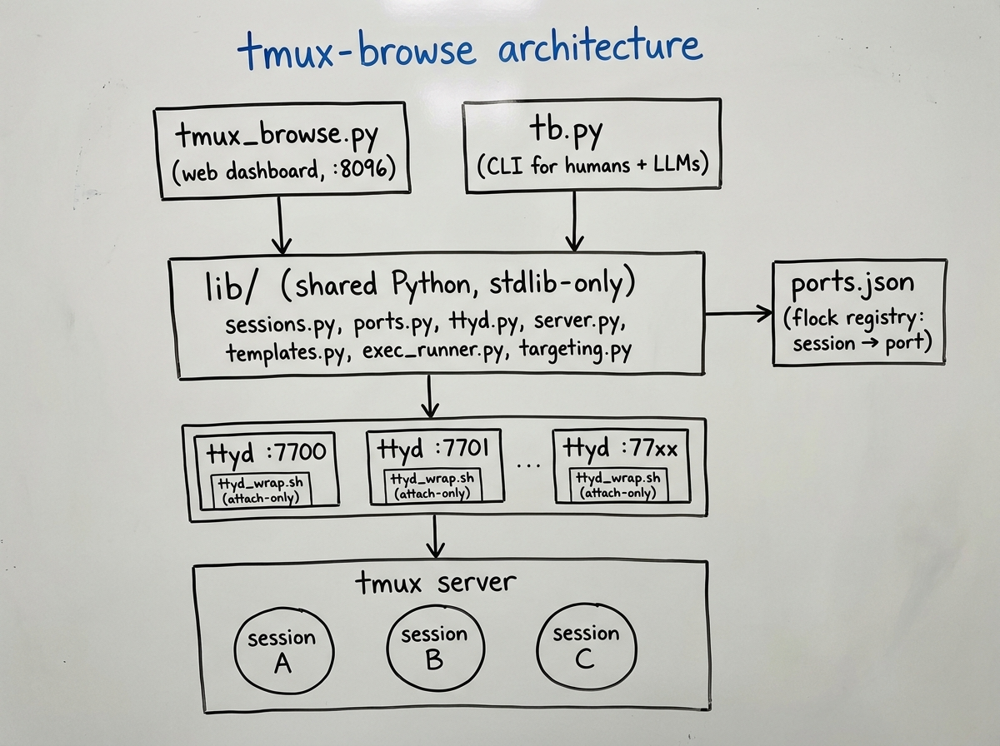

# Architecture

Why the project is shaped the way it is. Everything here is a deliberate
choice driven by the scope: "a single-host tmux toolkit that stays out of
the way."



## Principles

1. **Stdlib-only Python**, no pip dependencies. The whole thing is `http.server`,
   `urllib`, `subprocess`, `json`. That means: no virtualenv dance required
   to try it, no supply-chain surprises, and the project runs on whatever
   Python a freshly imaged Linux box ships with.
2. **Two CLIs, one library.** `tmux_browse.py` (dashboard) and `tb.py`
   (general CLI) share everything under `lib/`. A bug fixed in
   `lib/sessions.py` improves both surfaces at once.
3. **Stable contracts.** Exit codes, error `code` strings, and JSON
   envelopes don't change between patch versions. Human messages can.
4. **Boring defaults.** Sensible port numbers, 0.0.0.0 bind, no
   authentication — trusted-network assumptions, documented loudly in
   `docs/dashboard.md`. When you do tighten `--bind`, spawned ttyds inherit
   that network scope too.

## Module map

Core (everything in this repo):

```
lib/config.py              ports + paths (one place to tune)
lib/dashboard_config.py    validated dashboard UI config file helpers
lib/ports.py               JSON+flock registry: session name → stable port
lib/sessions.py            everything tmux-related (enumerate, capture, send)
lib/session_logs.py        per-session pipe-pane capture + SHA-256 tail hashing for idle
lib/host_identity.py       persistent device_id (UUID file) + short hostname
lib/ttyd.py                spawn/stop/track per-session ttyd, PID files, port probes
lib/ttyd_installer.py      fetch the ttyd static binary from GitHub releases
lib/server.py              http.server handler + dispatch tables + auth gate
lib/server_routes/         per-feature route handler modules (sessions/ttyd/config/clients/tasks/extensions/meta/ports)
lib/templates.py           dashboard HTML + slot substitution for extension UI
lib/static.py              asset loader; concatenates core JS + extension JS bundles
lib/targeting.py           Target dataclass + parser for session[:window[.pane]]
lib/errors.py              typed exceptions → stable exit codes
lib/output.py              table/JSON emitters with TTY-aware colour
lib/exec_runner.py         `tb exec` sentinel + idle strategies
lib/auth.py                optional Bearer-token auth
lib/tls.py                 optional TLS: cert/key resolve, SSLContext builder
lib/tasks.py               lightweight task store (title, repo, agent ref)
lib/extensions/            extension loader + catalog + submodule helpers
lib/extensions/__main__.py argparse driver behind ``python3 -m lib.extensions``
lib/tb_cmds/               one module per core tb verb group (read/write/lifecycle/observe/web/bulk/config_cmd)
```

Optional modules ship as submodules under `extensions/`, each pinned at
a tag in core's `.gitmodules`. Catalog entries live in
`lib/extensions/catalog.py`:

```
extensions/agent/          tmux-browse-agent — LLM agents, REPL, conductor,
                           workflow scheduler, cycle/work modes, knowledge
                           base, agent CRUD UI, /api/agent-* endpoints
extensions/sandbox/        tmux-browse-sandbox — Docker execution sandbox
                           (library-only; agent imports it when an agent
                           is configured with sandbox: docker)
extensions/qr/             tmux-browse-qr — QR config sharing (Show QR /
                           Read QR buttons, /api/qr endpoint)
extensions/federation/     tmux-browse-federation — LAN peer discovery
                           (UDP beacon), pair-gated session aggregation,
                           /api/peers + Federation Config card. Extracted
                           from core in 0.7.6.0; --no-federation now
                           skips loading the extension instead of
                           toggling an in-core feature
```

Frontend JS in core is concatenated at import time by `lib/static.py`
into one inlined `<script>` block:

```
static/util.js             DOM helpers, formatting, API wrapper
static/state.js            constants, normalizers, global state object
static/config.js           config form, apply, load/save, lock
static/audio.js            idle alert sound synthesis
static/phone-keys.js       mobile key customization with drag-to-reorder
static/sharing.js          ?import-cfg URL handling, view-config serializer
static/panes/idle-alerts.js  per-session idle alert config + firing
static/panes/hot-buttons.js  shared hot buttons + per-session hot loops
static/panes/send-queue.js   send-bar single + repeat-with-cooldown queue
static/panes/lifecycle.js    launch/stop ttyd, kill/new session, raw shells, fit
static/panes/layout.js       drag/drop, ordering, hidden / pane-group buckets
static/panes/modals.js       workflow editor + split picker
static/panes/render.js       createPane + updatePane (per-session DOM)
static/panes.js            refresh loop, init, callExt/bindExt cross-cutting helpers
static/extensions.js       Config > Extensions card, install/manage modal, restart banner
```

When extensions are loaded, each one's `static/*.js` is appended to
the bundle after a `window.__tbExtensions = window.__tbExtensions || []`
footer, so extension code can register against core globals safely.

Entry points:

- `tmux_browse.py` — dashboard CLI (serve, list, ports, start/stop ttyd, …)
- `tb.py` — general CLI, thin dispatch over `lib/tb_cmds/` plus
  whichever verbs each enabled extension's `tb_cmds/` registers
- `python3 -m lib.extensions` / `make {install,update,enable,disable,uninstall}-agent`
  — headless extension management

## Why `http.server` instead of a framework

The dashboard's route set is still small enough to fit comfortably in one
handler class: a handful of HTML/API routes, auth/TLS glue, and some process
management endpoints. Adding Flask would require users to set up a venv or
install packages. `http.server` with a `BaseHTTPRequestHandler` is enough for
this scope. The trade-off is that we don't get a framework middleware
ecosystem, but the only extra layers we actually need here are the project's
own auth/TLS helpers and a stable JSON envelope.

`ThreadingHTTPServer` + `daemon_threads=True` is enough for the tens of
concurrent requests the dashboard ever sees.

## Why the port registry

Users want **bookmarkable URLs**. If ttyd's port for "session X" changed
every time the dashboard restarted, bookmarks and iframe URLs would rot.
So:

- `lib/ports.py` persists `{session_name: port}` to JSON
- A session keeps its port forever (unless explicitly pruned)
- Allocations scan from `next_port` and wrap; never collide
- The file is `fcntl.flock`-protected so dashboard threads + CLI
  invocations don't race

Normal use still preserves stable session-to-port mappings, but startup now
does a targeted GC pass: dead ttyd pidfiles are removed and port assignments
for tmux sessions that no longer exist are pruned automatically. Explicit
`tmux-browse ports --prune` is still available when you want a manual sweep.

## Why `bin/ttyd_wrap.sh` exists

We don't just launch `ttyd bash` directly. We launch
`ttyd -W bash bin/ttyd_wrap.sh <session>`. The wrapper:

1. **Attaches to the named tmux session** — enabling multi-client terminal
   sharing (dashboard iframe + local `tmux attach` see the same state).
2. **Never creates sessions implicitly** — session creation is an explicit
   user action, keeping the tool predictable.
3. **Exits as soon as its tty disappears** via a `tty_alive` guard
   (`[ -t 0 ] && [ -t 1 ]`). Without that, every WebSocket reconnect
   leaks a wrapper process that lingers as a stale tmux client,
   eventually exhausting the tmux server's fd budget. This is a real
   failure mode observed in production; the `tty_alive` guard is the fix.

## Why the sentinel-based `exec`

Reading a command's output from tmux without modifying the user's shell
environment is harder than it looks. Two options:

- **Idle heuristic** — silence = done. Works anywhere, but can't see
  backgrounded output or get the exit status. `exit_status` is `null`.
- **Sentinel wrapping** — append
  `; printf '\n__TB_<tag>_END_%d__\n' $?` to the user's command, then
  poll `capture-pane` until the END marker shows up. Reliable;
  returns real exit status; trim is trivial (delete after the marker).

We prefer sentinel when the pane's `pane_current_command` is a shell
(`bash`/`zsh`/`fish`/`sh`), fall back to idle otherwise. `--strategy` lets
you force either.

The sentinel tag is 6 bytes of `secrets.token_hex`, so no risk of
colliding with whatever the user happens to be running.

## Why `lib/tb_cmds/` splits per verb group

`tb` has 19 verbs. A single 1500-line CLI file gets ugly. Splitting by
concern (read / write / lifecycle / observe / web / bulk) means:

- Each module is 100–200 lines, easy to skim.
- Adding a new verb = editing one file.
- Shared dispatch: every module exports `register(sub, common)`; the
  entry `tb.py` just loops over them via `register_all`.

The `common` argparse parent parser is the main reason `--json`, `--quiet`,
and `--no-header` work both before and after most verbs. Nested `tb agent`
submodes also preserve that contract with a small extra parsing layer.

## Why no shell completions (yet)

Not needed for LLM use; humans can get it quickly from `--help`. We can
add them later with `tb completion {bash,zsh,fish}` — the verb set is
already machine-readable from argparse introspection.

## Optional dashboard auth

`lib/auth.py` provides opt-in Bearer-token auth with stable exit-code
`EAUTH` (9). It's a thin gate — resolves `--auth` / `--auth-file` /
`$TMUX_BROWSE_TOKEN` in that priority, taking the first non-empty line from
the auth file, then checks `Authorization` / cookie / `?token=` query per
request with a constant-time compare. `/health` is deliberately exempt so
monitoring still works. The ttyd ports it spawns aren't covered by the same
token — documented in `docs/dashboard.md` because it's the obvious gotcha.

## Optional TLS

`lib/tls.py` resolves a `(cert, key)` pair from `--cert`/`--key` or
`$TMUX_BROWSE_CERT` / `$TMUX_BROWSE_KEY`, validates readability, and
returns an `ssl.SSLContext` (`PROTOCOL_TLS_SERVER`) that `lib/server.py`
uses to wrap the listening socket. Half-configured TLS is a hard error
(`ESTATE` / exit 8), not a silent fallback — more visible than guessing.

**Why the cert also goes to ttyd.** Browsers block `ws://` iframes
loaded from an `https://` origin as mixed content. So when the dashboard
serves HTTPS, every spawned ttyd must too. `lib/ttyd.py::start` accepts
the same `(cert, key)` paths and appends `--ssl --ssl-cert --ssl-key` to
the ttyd argv. It also writes a `<session>.scheme` sidecar in `PID_DIR`
so `tb web url` (a separate CLI process) knows which scheme to emit.
The sidecar is deleted alongside the pidfile on `stop()`.

**Why ttyd inherits `--bind`.** The dashboard's bind address is not just a
presentation detail; it defines the exposure boundary. `lib/server.py`
passes the configured bind address into `lib/ttyd.py`, which maps
`127.0.0.1` to loopback-only, `0.0.0.0` to wildcard exposure, and a
concrete host IP to the owning interface via `ip -o addr show`. That keeps
the dashboard and the ttyd terminals on the same reachability perimeter.

BYO cert only — no auto-generation. A self-signed `openssl req` recipe
is documented in the README; a hardened stack belongs behind a reverse
proxy, not inside this tool.

Why stdlib-only still works here: Python's `ssl` is stdlib; `ttyd --ssl`
ships with ttyd. Nothing new to install.

## Frontend: one HTML file, no build step

`lib/templates.py` and `lib/static.py` embed the full HTML/CSS/JS as Python
strings. The server renders `index.html` once per request with the static
assets inline — no separate static-file serving, no build tooling, no bundler.
The JS has grown into a small vanilla app rather than a tiny snippet, but it
is still dependency-free and ships as one embedded payload.

The whole page is re-hydrated every 5 s by calling `/api/sessions` and
diffing DOM panes against the new data (`state.nodes` map). This avoids
reloading the `<iframe>`s, which would tear down active ttyd connections.
Age fields (`idle_seconds`, `created_seconds_ago`) are computed server-side
so clock skew between browser and server doesn't report "idle 0s" for
every session after a laptop wake.

`idle_seconds` comes from a content hash, not from tmux's `session_activity`.
`lib/session_logs.py` keeps every session piped to
`~/.tmux-browse/session-logs/<name>.log` via `tmux pipe-pane -o` (idempotent,
so re-asserting on every `/api/sessions` call is safe and catches panes
added after session creation). The handler hashes the trailing 8 KiB with
SHA-256; unchanged hash keeps the activity timestamp pinned, and any
change bumps it to now. This fixes two previous failure modes: a pane
with only cursor blinks would look active under `session_activity`, and a
long-thinking agent with no output would look idle under it.

When `auto_refresh` is off, a dedicated 60-second `pollIdleOnly()` loop
still hits `/api/sessions` so idle labels and idle-alert firing stay
current without rebuilding panes; it skips sessions in `state.hidden`.

Reordering and hiding state live in `localStorage` (`tmux-browse:order`
and `tmux-browse:hidden`), per-browser per-origin. Intentionally not
server-side: ordering preferences are a viewer concern, not a machine
concern, so two people hitting the same dashboard from different browsers
can arrange their views differently.

Dashboard behavior settings are different: they live in
`~/.tmux-browse/dashboard-config.json` via `lib/dashboard_config.py`, so the
web config pane and `tmux-browse config` CLI both operate on the same file.

The UI now also carries more interaction state than the original dashboard:
side-by-side layout rows, split placement, hot-button loop settings, and idle
alerts all live in the same no-build frontend rather than being pushed into
a separate asset pipeline.

Raw ttyd sessions are the exception to the normal "one ttyd per tmux
session" rule. They are still tracked in the same pid/scheme machinery, but
they render as inline pane cards in a dedicated `#raw-shells` container
above the main session list — clicking the **Raw ttyd** topbar button
spawns a shell, mounts an iframe pane in place, and exposes a **Stop**
button that calls ``/api/ttyd/stop`` and removes the card.

## Failure modes we actively guard against

| Hazard | Mitigation |
|---|---|
| Stale ttyd wrappers pile up as tmux clients | `tty_alive` guard in `bin/ttyd_wrap.sh` |
| Port collision on restart | `lib/ports.py` probes + refuses to stomp a listening port |
| Dashboard PID file left behind after crash | PID files are re-validated (`os.kill(pid, 0)`) before use |
| Concurrent port allocations race | `fcntl.flock` on `ports.json` |
| tmux prefix-matching ambiguity | Most tmux commands use `=name` for exact match; `capture-pane` uses `name:` |
| Iframe reload on every 5 s refresh | DOM diff instead of full re-render |
| Keyboard events swallowed while dragging iframe | `.ttyd-resize-wrap` wrapper owns the resize handle |
| Sentinel collision with user output | 48-bit random tag per `exec` call |
| `paste` mangled by terminal quirks | `load-buffer` + `paste-buffer -d` instead of `send-keys -l` |

## Extending

To add a new tb verb:

1. Pick a module in `lib/tb_cmds/` (or add a new one if it's a new group).
2. Write the `cmd_foo(args)` function. Raise a `TBError` subclass on
   failure; return `0` on success.
3. Add the subparser in the module's `register(sub, common)`, pass
   `parents=[common]` so global flags inherit. Wire
   `p.set_defaults(func=cmd_foo)`.
4. If it's a new module, call it from `lib/tb_cmds/__init__.py::register_all`.

To add a new HTTP route:

1. Add a `_h_*` method in `lib/server.py`'s `Handler` class.
2. Register it in `_GET_ROUTES` or `_POST_ROUTES` (`MappingProxyType` dicts).
3. Delegate to a helper module rather than shelling out inline.
4. Return via `_send_json` / `_send_text` / `_send_html` so the
   Content-Type and envelope stay consistent.

To change dashboard behaviour:

- CSS → `static/app.css`
- JS → `static/app.js`
- HTML skeleton → `lib/templates.py`

No build step; restart the server to see changes.

To build a new extension:

1. Mirror the layout of an existing one (`extensions/agent/` is the
   most full-featured; `extensions/federation/` is a smaller
   reference). Required files: `manifest.json`, the importable
   package directory, `LICENSE`, `pyproject.toml`, `.gitignore`.
2. **Scope every module under your manifest's ``module`` name.**
   The agent extension uses `server/routes.py` and that pattern
   reads naturally, but `server` is a top-level namespace package —
   if a second extension also uses `server/routes.py`, Python's
   namespace-package merge picks one of them based on `sys.path`
   order and silently drops the other's submodule. The federation
   extension demonstrates the safe pattern: routes live at
   `federation/routes.py` and the manifest's `routes_entry` is
   `federation.routes:register`. Treat the `module` name as your
   private namespace.
3. Add a `CatalogEntry` to `lib/extensions/catalog.py` so the
   Config UI's install button knows the repo URL and pinned tag.
4. Add a `.gitmodules` entry pointing at the public repo and a
   submodule `git rev` pinned to a versioned tag.
5. Wire `make {install,update,enable,disable,uninstall}-<name>`
   targets in the core `Makefile` for headless setups.

Available extension hooks (returned via the manifest's
`routes_entry` callback's `Registration`):

- `get_routes` / `post_routes` — `dict[str, Callable]` that the
  core merges into its dispatch tables. Collisions with core or
  another extension raise at startup.
- `cli_verbs` — registers `tb <verb>` handlers (agent uses this
  for `tb agent ...`).
- `ui_blocks` — fills named `<!--slot:name-->` markers in
  `lib/templates.py` with extension HTML. Slot names are
  declared in core's `_SLOTS` tuple; typos fail at startup.
- `static_js` — extension's `static/*.js` files appended to the
  bundle after `window.__tbExtensions = ...` so extension code
  sees core globals.
- `startup` / `shutdown` — `Callable[[httpd], None]` /
  `Callable[[], None]` for lifecycle (federation's broadcaster
  threads use this).
- `session_post_processors` — `Callable[[list[dict]], None]` that
  mutates `_session_summary`'s row list in place; called only when
  the request is the local refresh, not a peer-originated
  `?local=1` fetch. Federation uses this to fan out to paired
  peers and append their rows.
